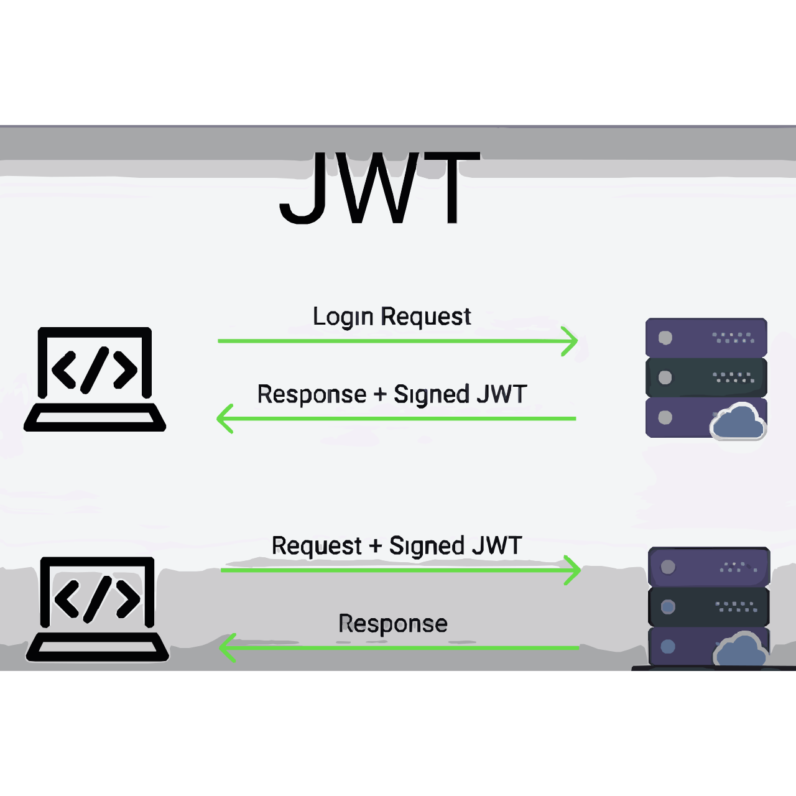

## JSON web token base project
in this project the route is been securitize 
as in other projects anyone can access the API but this one they neeed to be authenticated and authorized

### New package unlocked
```javascript
"http-status-codes": "^2.1.4",
"jsonwebtoken": "^8.5.1",
```

#### Concept for JWT


for more info look this web
https://jwt.io/

no Database been integreted in this project it work on simply backend

http is stateless it means that server does not remember any previous request sent by the same client 
frontend always need to provide the TOKEN to access the data 

MEANS :: user always need to give the token to access their data cause server never remember how many time user have given token

when ever you use the JWT SECRET in production use long, complex and unguessable string value

2. learned how to send the token through the headers

3. Error handling gets extended and it is done by the package name 
'http-status-codes' 
```javascript
const CustomAPIError = require('./custom-error')
const { StatusCodes } = require('http-status-codes')  // This one

class BadRequest extends CustomAPIError {
    constructor(message) {
      super(message)
      this.statusCode = StatusCodes.BAD_REQUEST  // This one 
    }
  }
  
  module.exports = BadRequest
  
```
For more infomation you can go to the NPM library and package manager website to get the brief about it 
here is your link checkout :- https://www.npmjs.com/package/http-status-codes